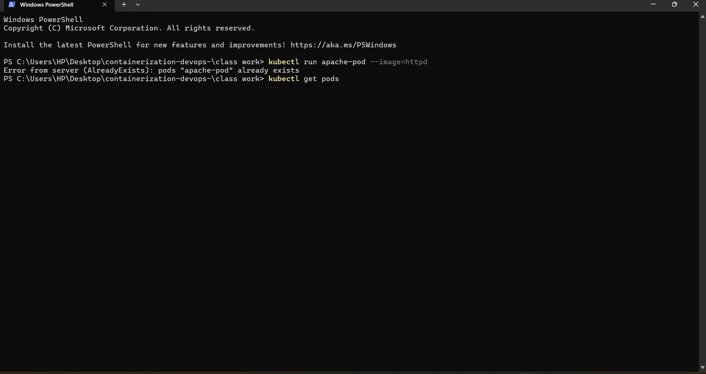
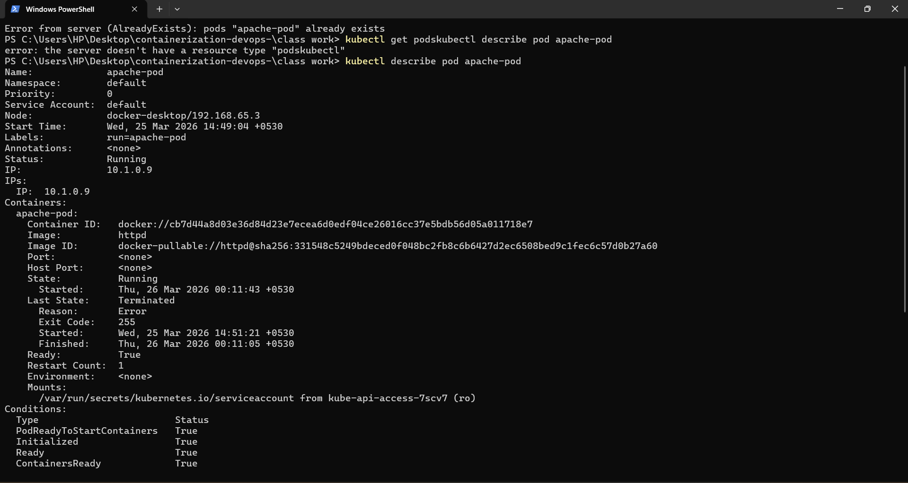
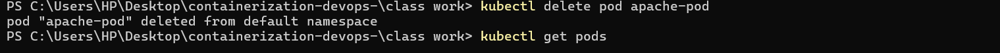
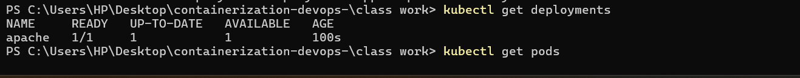
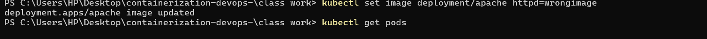
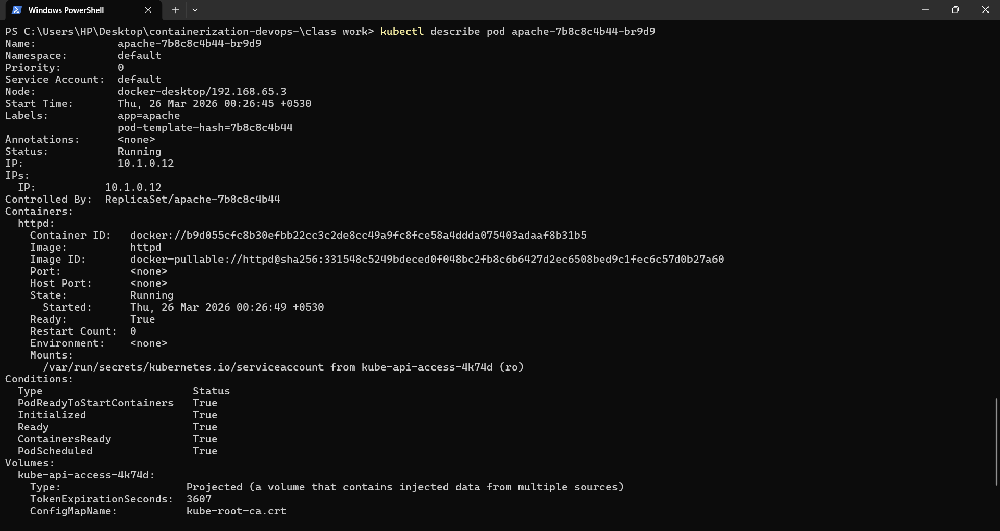
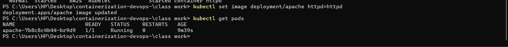
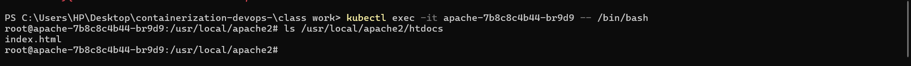
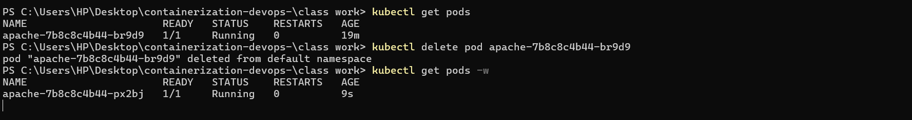
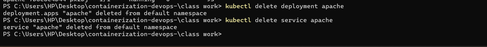

# 🚀 Hello Web App (Apache httpd) – Kubernetes

## 🎯 Objective

Deploy and manage an Apache web server using Kubernetes. Learn Pods, Deployments, Services, Debugging, and Self-Healing.

---

# ⚙️ Step-by-Step Implementation

## 🟢 1. Pod Creation

```bash
kubectl run apache-pod --image=httpd
kubectl get pods
```

📸 Screenshot:


---

## 🔍 2. Inspect Pod

```bash
kubectl describe pod apache-pod
```

📸 Screenshot:


---

## 🌐 3. Access Web App

```bash
kubectl port-forward pod/apache-pod 8081:80
```

Open in browser:
http://localhost:8081

📸 Screenshot:


---

## ❌ 4. Delete Pod

```bash
kubectl delete pod apache-pod
```

📸 Screenshot:


---

# 🔁 Deployment (Auto-Healing)

## 🚀 5. Create Deployment

```bash
kubectl create deployment apache --image=httpd
kubectl get deployments
kubectl get pods
```

📸 Screenshot:


---

## 🌍 6. Expose Deployment (Service)

```bash
kubectl expose deployment apache --port=80 --type=NodePort
kubectl port-forward service/apache 8082:80
```

Open in browser:
http://localhost:8082

📸 Screenshot:


---

# 🐞 Debugging Scenario

## ❌ 7. Break the Application

```bash
kubectl set image deployment/apache httpd=wrongimage
kubectl get pods
```

📸 Screenshot:


---

## 🔎 8. Diagnose Issue

```bash
kubectl describe pod <pod-name>
```

📸 Screenshot:


---

## 🔧 9. Fix the Application

```bash
kubectl set image deployment/apache httpd=httpd
```

📸 Screenshot:


---

# 🔍 10. Explore Container

```bash
kubectl exec -it <pod-name> -- /bin/bash
ls /usr/local/apache2/htdocs
```

📸 Screenshot:


---

# 🔁 11. Self-Healing Test

```bash
kubectl delete pod <pod-name>
kubectl get pods -w
```

📸 Screenshot:


---

# 🧹 12. Cleanup

```bash
kubectl delete deployment apache
kubectl delete service apache
```

📸 Screenshot:


---

# 📚 Key Learnings

* 🔹 Pod is temporary (no self-healing)
* 🔹 Deployment provides auto-healing and scalability
* 🔹 Service exposes application
* 🔹 Debugging using `kubectl describe`
* 🔹 Kubernetes automatically recreates pods

---

# 🏁 Conclusion

This project demonstrates how Kubernetes efficiently manages containerized applications using Pods, Deployments, and Services with debugging and self-healing capabilities.

---

