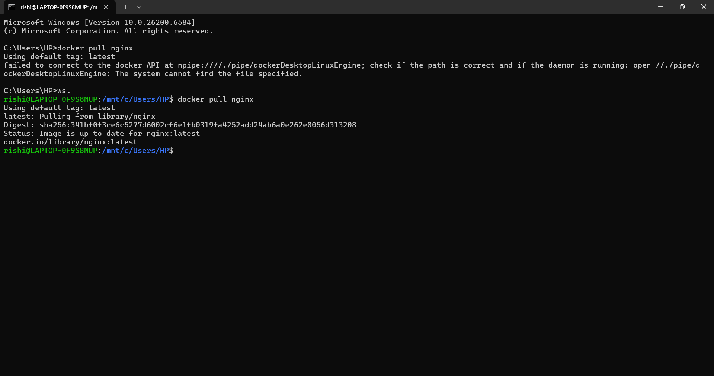
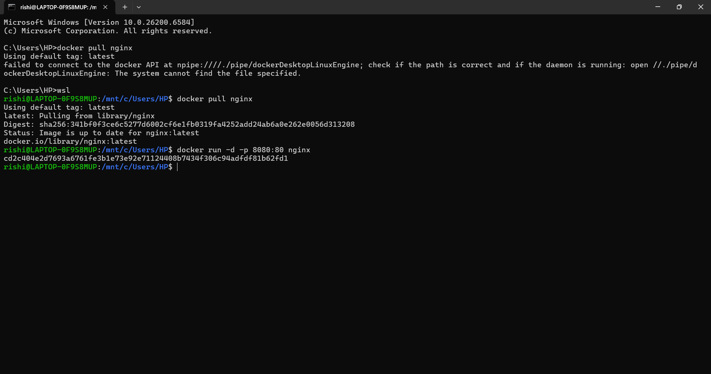
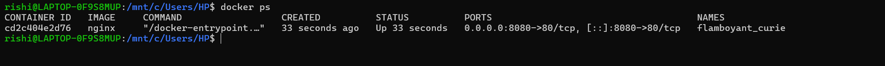
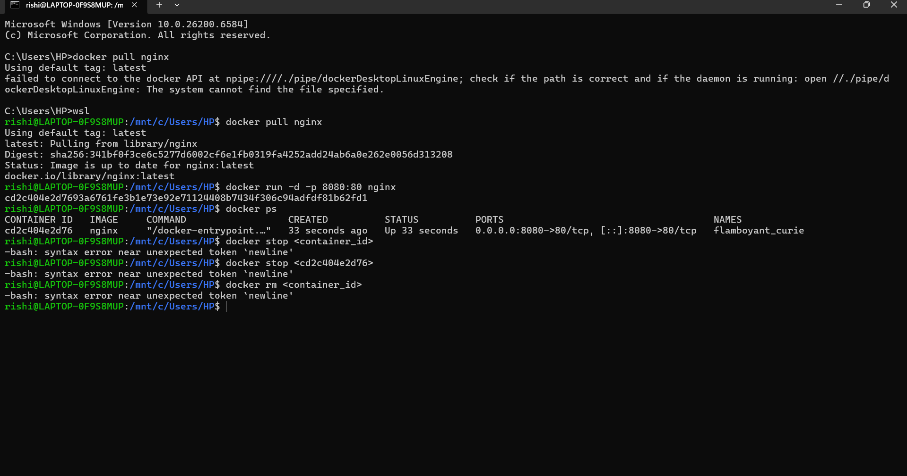

**Name:** Rishiraj Singh 
**SAP ID:** 500123612 
**Batch:** B3 (CCVT)

# Lab – Experiment 2

## Objective
- Pull Docker images
- Run containers
- Manage container lifecycle

---
## Procedure

> Docker containers are lightweight, portable, and share the host OS kernel. This makes them ideal for rapid deployment and efficient resource usage compared to traditional VMs.

### Step 1: Pull Image
> The `docker pull` command downloads the specified image from Docker Hub, making it available locally for container creation.
```bash
docker pull nginx
```


### Step 2: Run Container with Port Mapping
> The `docker run` command creates and starts a new container from the specified image. The `-p 8080:80` flag maps port 80 in the container to port 8080 on the host, allowing access to the web server from your browser.
```bash
docker run -d -p 8080:80 nginx
```


### Step 3: Verify Running Containers
> The `docker ps` command lists all running containers, helping you verify that your Nginx container is up and running.
```bash
docker ps
```


### Step 4: Stop and Remove Container
> **Theory:** Stopping and removing containers is essential for managing system resources and cleaning up unused containers.
```bash
docker stop <container_id>
docker rm <container_id>
```


### Step 5: Remove Image
>   Removing images you no longer need helps free up disk space and keeps your Docker environment clean.
```bash
docker rmi nginx
```


---
## Result
Docker images were successfully pulled, containers executed, and lifecycle commands performed.

---
## Read More (Experiment 2)
- [Docker Images](https://docs.docker.com/get-started/docker-concepts/building-images/)
- [Docker CLI Reference](https://docs.docker.com/engine/reference/commandline/docker/)
- [Docker Hub](https://hub.docker.com/)

---
## Overall Conclusion
This lab demonstrated virtualization using Vagrant + VirtualBox and containerization using Docker, highlighting clear performance and resource efficiency differences. Containers are better suited for rapid deployment and microservices, while VMs provide stronger isolation.

---
