**Name:** Rishiraj Singh 
**SAP ID:** 50012361
**Batch:** B3 (CCVT)

# Lab – Experiment 3

## Deploying NGINX Using Different Base Images and Comparing Image Layers

---
## Lab Objectives
After completing this lab, students will be able to:
- Deploy NGINX using official, Ubuntu-based, and Alpine-based images
- Understand Docker image layers and size differences
- Compare performance, security, and use-cases of each approach
- Explain real-world use of NGINX in containerized systems

---
## Prerequisites
- Docker installed and running
- Basic knowledge of: `docker run`, Dockerfile, port mapping, Linux command basics

---
## Part 1: Deploy NGINX Using Official Image (Recommended Approach)
### Step 1: Pull the Image
```bash
docker pull nginx:latest
```
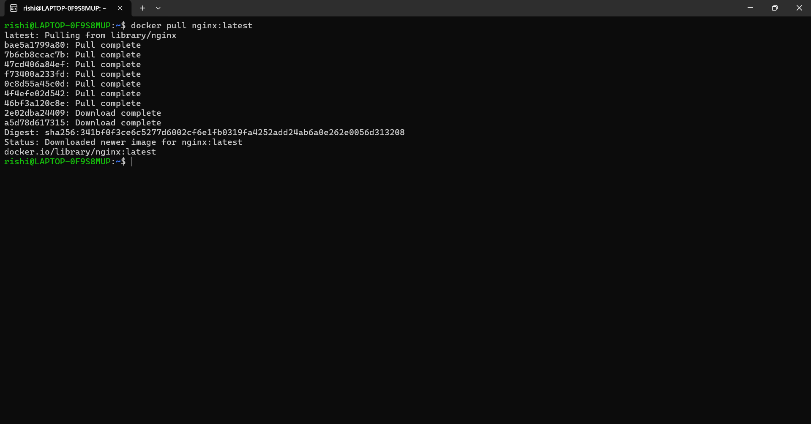

### Step 2: Run the Container
```bash
docker run -d --name nginx-official -p 8080:80 nginx
```
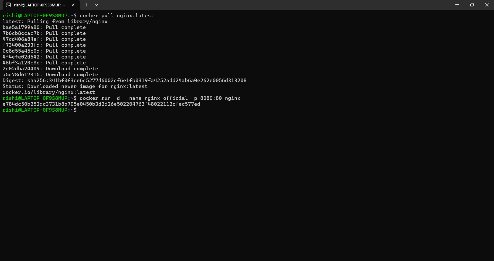

### Step 3: Verify
```bash
curl http://localhost:8080
```
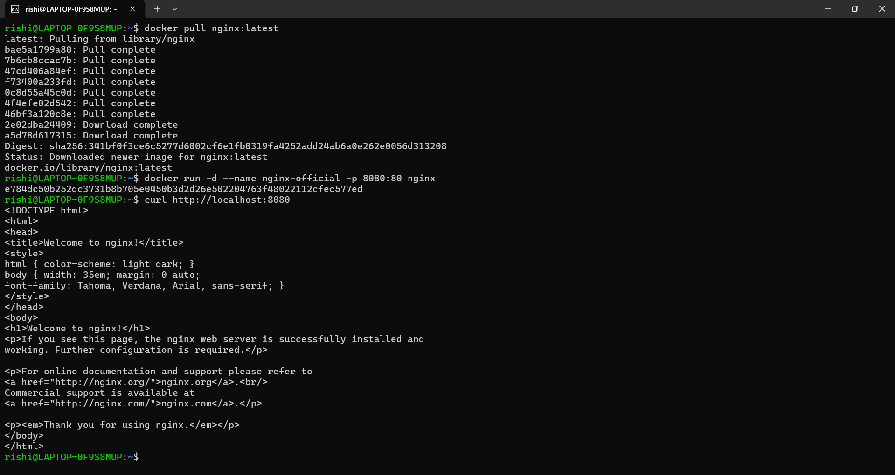

### Key Observations
```bash
docker images nginx
```
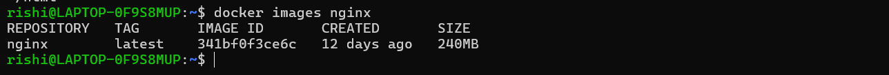

- Image is pre-optimized
- Minimal configuration required
- Uses Debian-based OS internally

---
## Part 2: Custom NGINX Using Ubuntu Base Image
### Step 1: Create Dockerfile
```dockerfile
FROM ubuntu:22.04
RUN apt-get update && \
    apt-get install -y nginx && \
    apt-get clean && \
    rm -rf /var/lib/apt/lists/*
EXPOSE 80
CMD ["nginx", "-g", "daemon off;"]
```
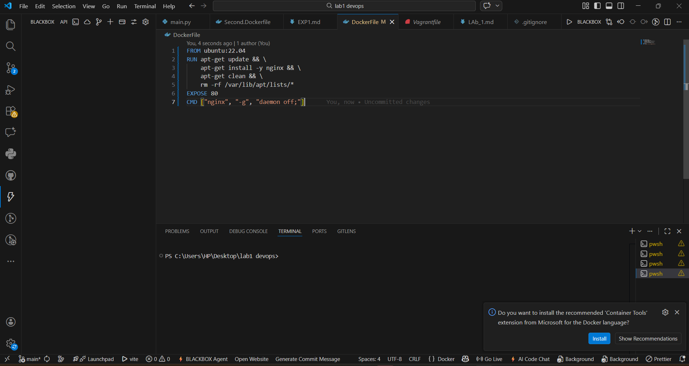

### Step 2: Build Image
```bash
docker build -t nginx-ubuntu .
```
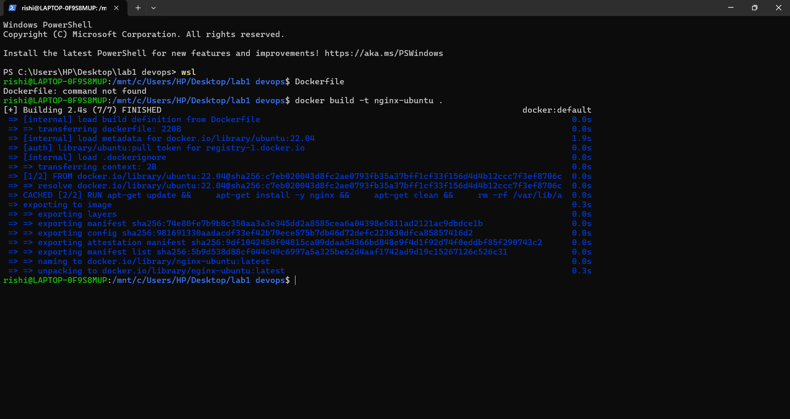

### Step 3: Run Container
```bash
docker run -d --name nginx-ubuntu -p 8081:80 nginx-ubuntu
```
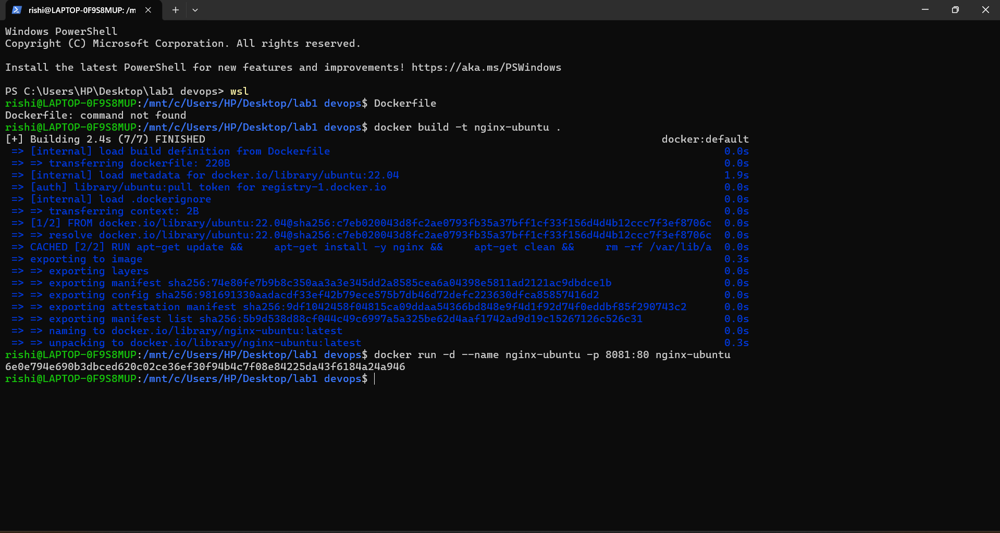

### Observations
```bash
docker images nginx-ubuntu
```
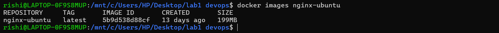
- Much larger image size
- More layers
- Full OS utilities available

---
## Part 3: Custom NGINX Using Alpine Base Image
### Step 1: Create Dockerfile
```dockerfile
FROM alpine:latest
RUN apk add --no-cache nginx
EXPOSE 80
CMD ["nginx", "-g", "daemon off;"]
```


### Step 2: Build Image
```bash
docker build -t nginx-alpine .
```
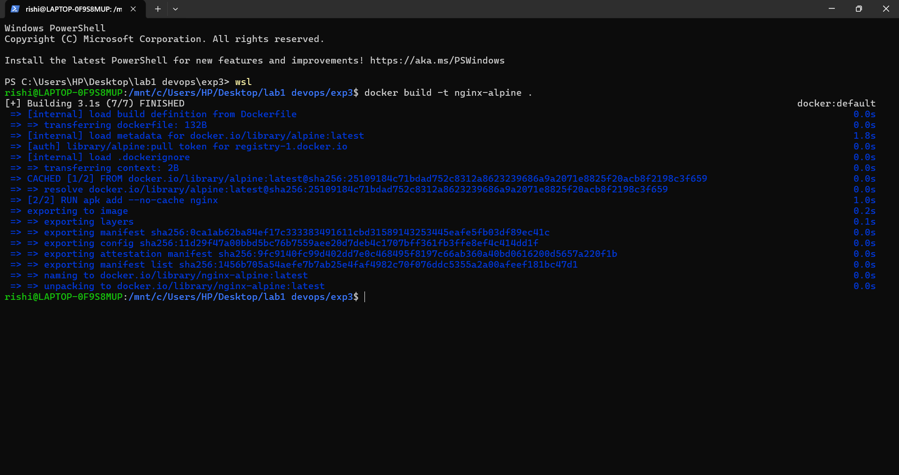

### Step 3: Run Container
```bash
docker run -d --name nginx-alpine -p 8082:80 nginx-alpine
```
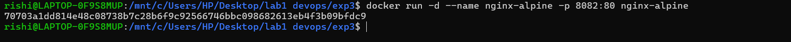

### Observations
```bash
docker images nginx-alpine
```
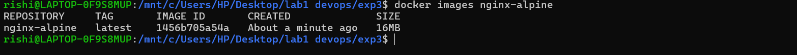
- Extremely small image
- Fewer packages
- Faster pull and startup time

---
## Part 4: Image Size and Layer Comparison
### Compare Sizes
```bash
docker images | grep nginx
```
Typical result (approx):
| Image Type     | Size      |
|---------------|-----------|
| nginx:latest  | ~140 MB   |
| nginx-ubuntu  | ~220+ MB  |
| nginx-alpine  | ~25–30 MB |

### Inspect Layers
```bash
docker history nginx
```
![nginx History(images/e5.png)
```bash
docker history nginx-ubuntu
```
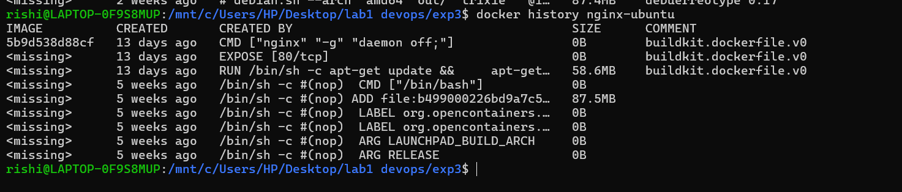
```bash
docker history nginx-alpine
```
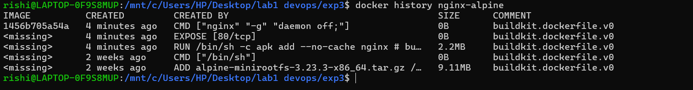

- Ubuntu has many filesystem layers
- Alpine has minimal layers
- Official NGINX image is optimized but heavier than Alpine

---
## Part 5: Functional Tasks Using NGINX
### Task 1: Serve Custom HTML Page
```bash
mkdir html
echo "<h1>Hello from Docker NGINX</h1>" > html/index.html
```
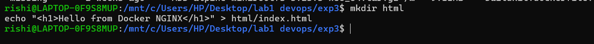
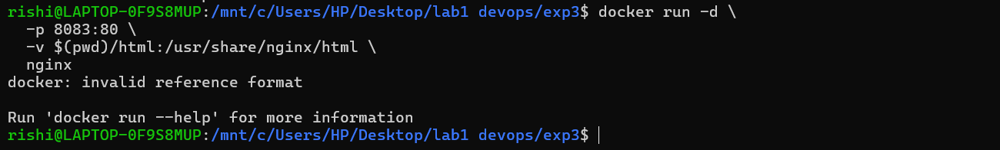

Run:
```bash
docker run -d \
  -p 8083:80 \
  -v $(pwd)/html:/usr/share/nginx/html \
  nginx
```


---
## Part 6: Comparison Summary
| Feature         | Official NGINX | Ubuntu + NGINX | Alpine + NGINX |
|-----------------|:--------------:|:--------------:|:--------------:|
| Image Size      | Medium         | Large          | Very Small     |
| Ease of Use     | Very Easy      | Medium         | Medium         |
| Startup Time    | Fast           | Slow           | Very Fast      |
| Debugging Tools | Limited        | Excellent      | Minimal        |
| Security Surface| Medium         | Large          | Small          |
| Production Ready| Yes            | Rarely         | Yes            |

---
## Part 7: When to Use What
- **Official NGINX Image:** Production deployment, standard web hosting, reverse proxy/load balancer
- **Ubuntu-Based Image:** Learning Linux + NGINX internals, heavy debugging, custom system-level dependencies
- **Alpine-Based Image:** Microservices, CI/CD pipelines, cloud and Kubernetes workloads

---
## Lab Assignment (For Students)

#### Answers to Lab Assignment Questions

**Why are Alpine images smaller?**
Alpine Linux is designed to be minimal and secure, with a much smaller footprint than Ubuntu. It uses musl libc and busybox, which are lightweight alternatives to the standard libraries and utilities found in Ubuntu. This results in much smaller Docker images, faster downloads, and reduced attack surface.

**Why are Ubuntu images avoided in production?**
Ubuntu images are avoided in production because they are larger, have a bigger attack surface, and include unnecessary packages. Smaller images like Alpine reduce security risks, speed up deployment, and use less storage and bandwidth.

**Why is customizing the NGINX config important?**
Customizing the NGINX config allows you to adapt the web server for different use cases, such as changing the default port, adding authentication, or optimizing for static file serving. Removing unused layers in the Dockerfile reduces image size and attack surface, making your containers more secure and efficient.

- Add a custom NGINX config to:
  - Change default port
  - Add basic auth
  - Remove unused layers and rebuild image
  - 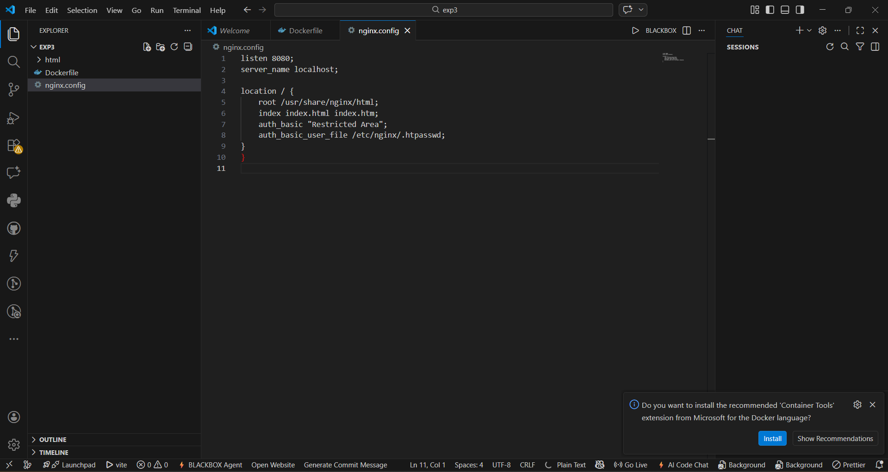

- Explain:
  - Why Alpine images are smaller
  - Why Ubuntu images are avoided in production

---
## Expected Learning Outcome
By the end of this lab, students should clearly understand:
- Docker image construction
- Base image impact on size and security
- Why official images exist
- Real-world NGINX usage in container platforms

---
## References & Further Reading
- [NGINX Web Server: How to Use It and Why It’s Powerful](https://www.nginx.com/resources/wiki/)
- [Docker Official Documentation](https://docs.docker.com/)
- [NGINX Docker Hub](https://hub.docker.com/_/nginx)
