**Name:** Rishiraj Singh
**SAP ID:** 500123612
**Batch:** B3 (CCVT)

# Lab – Experiment 4

## Docker Essentials

---
## Lab Objectives
After completing this lab, students will be able to:
- Understand Dockerfile structure and best practices
- Use .dockerignore to optimize builds
- Build, tag, and manage Docker images
- Run and manage containers effectively
- Implement multi-stage builds for optimization
- Publish images to Docker Hub
- Containerize both Python Flask and Node.js applications

---
## Prerequisites
- Docker installed and running
- Basic knowledge of: `docker build`, `docker run`, Dockerfile syntax, port mapping
- Familiarity with Python and Node.js (optional but helpful)

## Part 1: Containerizing Applications with Dockerfile
### Step 1: Create a Simple Application
#### Python Flask App:
```bash
mkdir my-flask-app
cd my-flask-app
```
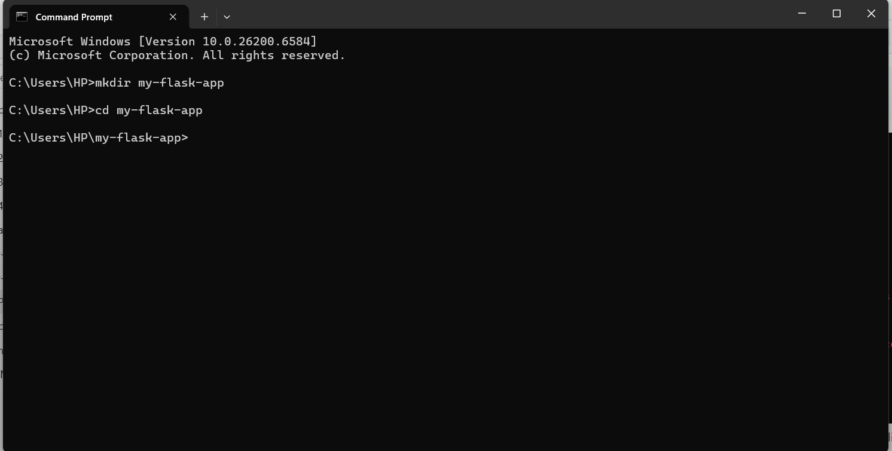
*Explanation:* These commands create a new directory called `my-flask-app` and navigate into it. This organizes our Flask application code in its own folder.

**app.py:**
```python
from flask import Flask
app = Flask(__name__)

@app.route('/')
def hello():
    return "Hello from Docker!"

@app.route('/health')
def health():
    return "OK"

if __name__ == '__main__':
    app.run(host='0.0.0.0', port=5000)
```
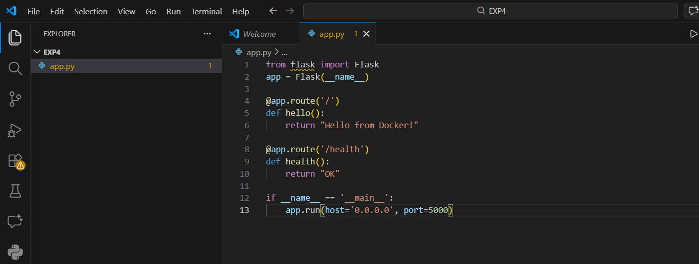
*Explanation:* This is a simple Flask web application with two routes: the root path returns a greeting message, and the `/health` endpoint returns "OK" for health checks. The app is configured to listen on all interfaces (0.0.0.0) on port 5000.

**requirements.txt:**
```
Flask==2.3.3
```
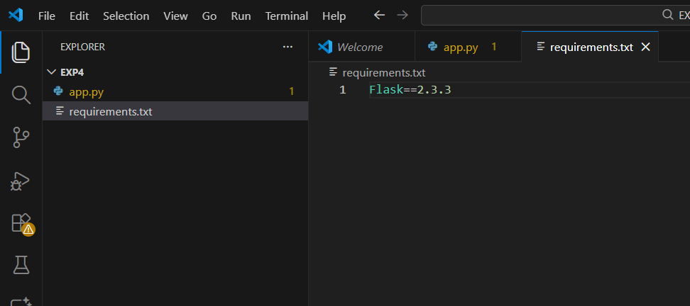
*Explanation:* This file specifies the Python dependencies needed for the application. Here, we're using Flask version 2.3.3 as the only requirement.

### Step 2: Create Dockerfile
**Dockerfile:**
```dockerfile
# Use Python base image
FROM python:3.9-slim

# Set working directory
WORKDIR /app

# Copy requirements file
COPY requirements.txt .

# Install dependencies
RUN pip install --no-cache-dir -r requirements.txt

# Copy application code
COPY app.py .

# Expose port
EXPOSE 5000

# Run the application
CMD ["python", "app.py"]
```
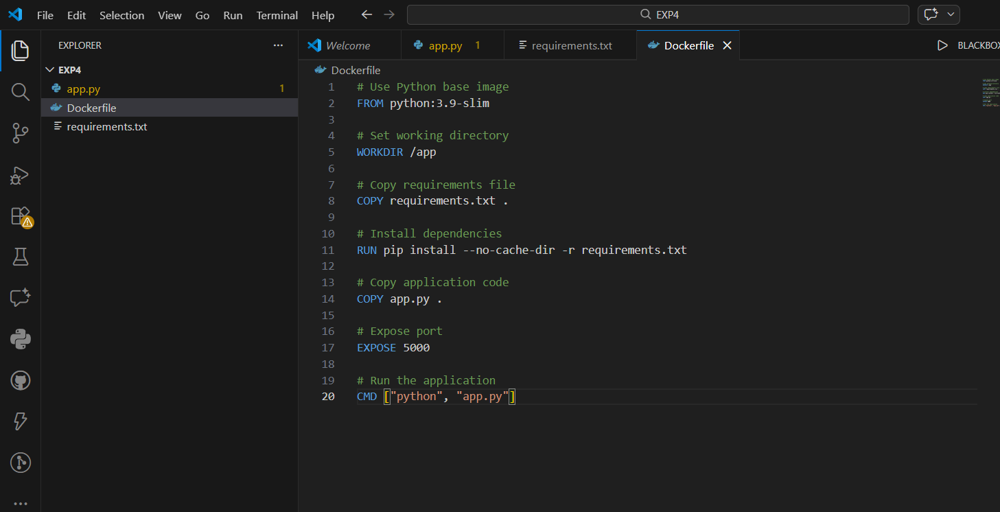
*Explanation:* This Dockerfile defines how to build a Docker image for our Flask app. It starts with a lightweight Python base image, sets up the working directory, installs dependencies, copies the app code, exposes port 5000, and specifies the command to run the application.

---
## Part 2: Using .dockerignore
### Step 1: Create .dockerignore File
**.dockerignore:**
```
# Python files
__pycache__/
*.pyc
*.pyo
*.pyd

# Environment files
.env
.venv
env/
venv/

# IDE files
.vscode/
.idea/

# Git files
.git/
.gitignore

# OS files
.DS_Store
Thumbs.db

# Logs
*.log
logs/

# Test files
tests/
test_*.py
```
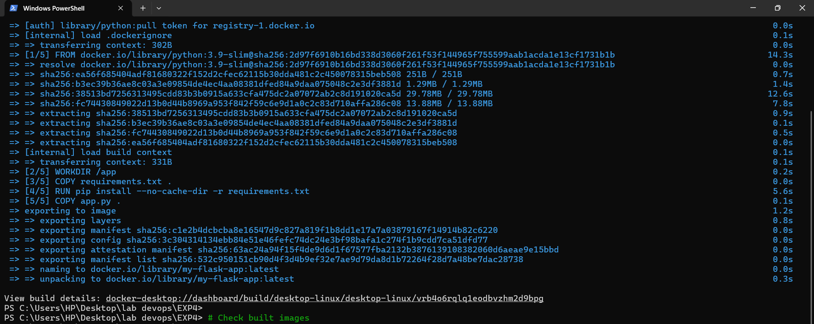
*Explanation:* The `.dockerignore` file tells Docker which files and directories to exclude when building the image. This prevents unnecessary files from being copied into the image, reducing its size and improving build performance.

### Step 2: Why .dockerignore is Important
- Prevents unnecessary files from being copied
- Reduces image size
- Improves build speed
- Increases security
*Explanation:* These benefits make `.dockerignore` a best practice for Docker development. By excluding development artifacts, cache files, and sensitive data, you create cleaner, smaller, and more secure images.

---
## Part 3: Building Docker Images
### Step 1: Basic Build Command
```bash
# Build image from Dockerfile
docker build -t my-flask-app .

# Check built images
docker images
```
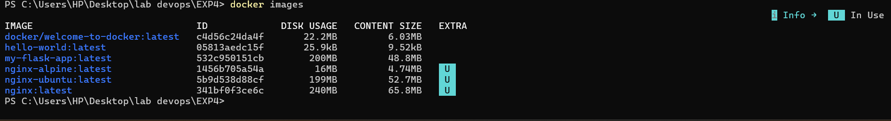
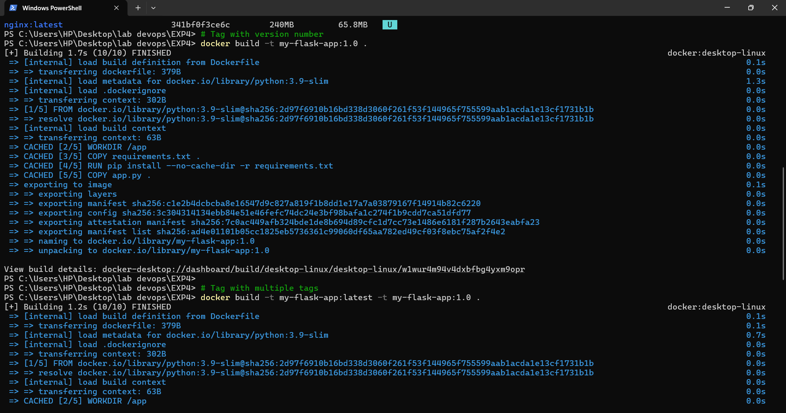
*Explanation:* The `docker build` command creates an image from the Dockerfile in the current directory (indicated by `.`) and tags it as `my-flask-app`. The `docker images` command lists all available images on your system, allowing you to verify the build was successful.

### Step 2: Tagging Images
```bash
# Tag with version number
docker build -t my-flask-app:1.0 .

# Tag with multiple tags
docker build -t my-flask-app:latest -t my-flask-app:1.0 .

# Tag with custom registry
docker build -t username/my-flask-app:1.0 .

# Tag existing image
docker tag my-flask-app:latest my-flask-app:v1.0
```
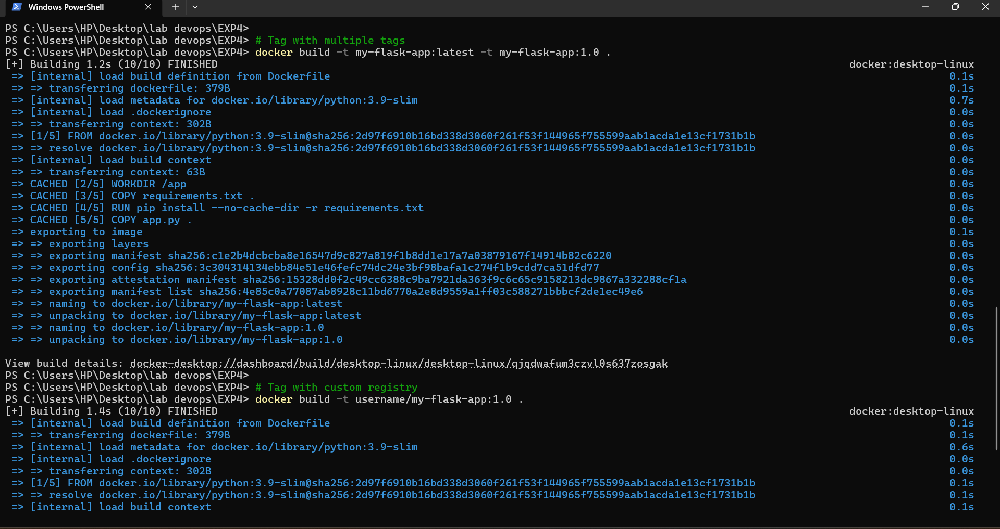
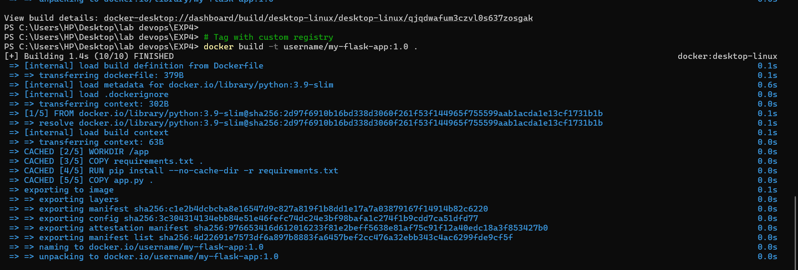
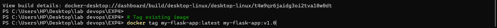
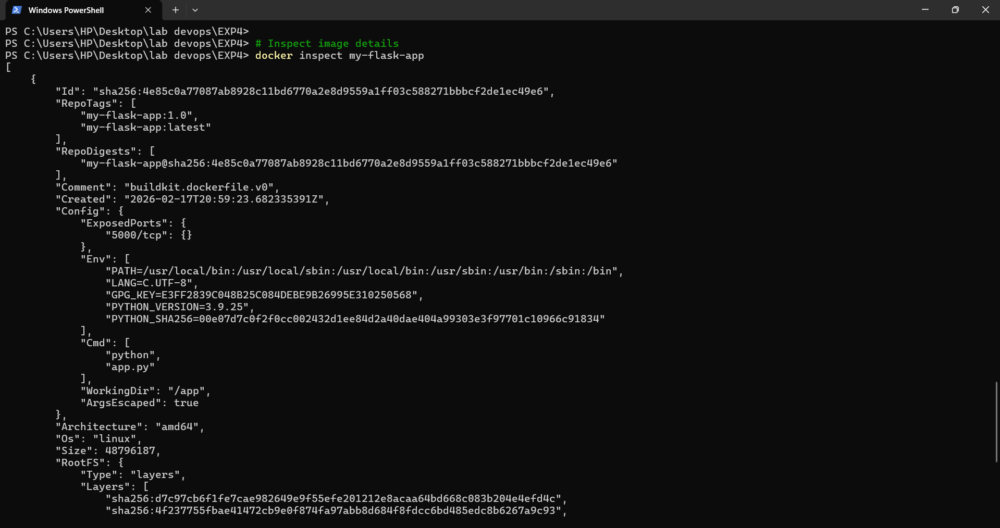
*Explanation:* Tagging allows you to version your images. The first command tags during build, while `docker tag` can rename existing images. Multiple tags can point to the same image, and registry prefixes (like `username/`) prepare images for pushing to Docker Hub.

### Step 3: View Image Details
```bash
# List all images
docker images

# Show image history
docker history my-flask-app

# Inspect image details
docker inspect my-flask-app
```
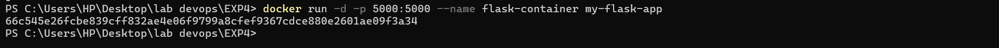
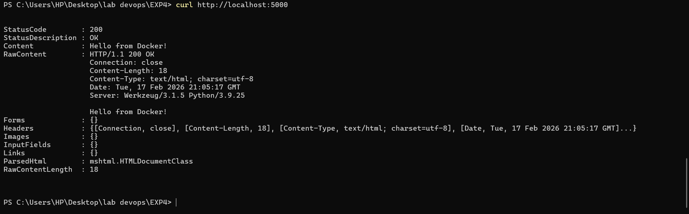
*Explanation:* These commands provide different levels of information about your images. `docker images` shows basic info, `docker history` reveals the layers that make up the image, and `docker inspect` provides detailed metadata in JSON format.

---
## Part 4: Running Containers
### Step 1: Run Container
```bash
# Run container with port mapping
docker run -d -p 5000:5000 --name flask-container my-flask-app

# Test the application
curl http://localhost:5000

# View running containers
docker ps

# View container logs
docker logs flask-container
```
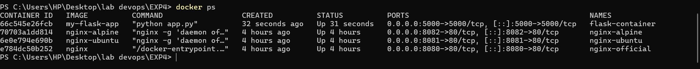
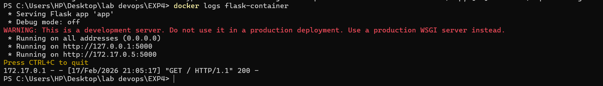
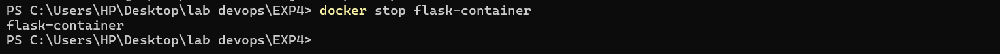
*Explanation:* `docker run` starts a container from the image. The `-d` flag runs it in detached mode, `-p` maps host port 5000 to container port 5000, and `--name` gives it a friendly name. `curl` tests the web app, `docker ps` lists running containers, and `docker logs` shows the container's output.

### Step 2: Manage Containers
```bash
# Stop container
docker stop flask-container

# Start stopped container
docker start flask-container

# Remove container
docker rm flask-container

# Remove container forcefully
docker rm -f flask-container
```
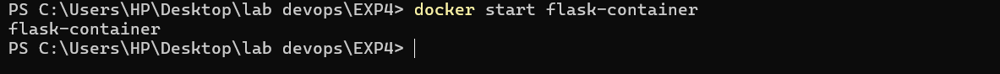
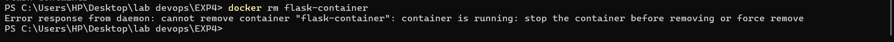
*Explanation:* These commands control the container lifecycle. `docker stop` gracefully stops the container, `docker start` restarts a stopped container, `docker rm` removes a stopped container, and `-f` forces removal of running containers.

---
## Part 5: Multi-stage Builds
### Step 1: Why Multi-stage Builds?
- Smaller final image size
- Better security (remove build tools)
- Separate build and runtime environments
*Explanation:* Multi-stage builds allow you to use different base images for building and running your application. This results in smaller final images since build tools and dependencies aren't included in the runtime image.

### Step 2: Simple Multi-stage Dockerfile
**Dockerfile.multistage:**
```dockerfile
# STAGE 1: Builder stage
FROM python:3.9-slim AS builder

WORKDIR /app

# Copy requirements
COPY requirements.txt .

# Install dependencies in virtual environment
RUN python -m venv /opt/venv
ENV PATH="/opt/venv/bin:$PATH"
RUN pip install --no-cache-dir -r requirements.txt

# STAGE 2: Runtime stage
FROM python:3.9-slim

WORKDIR /app

# Copy virtual environment from builder
COPY --from=builder /opt/venv /opt/venv
ENV PATH="/opt/venv/bin:$PATH"

# Copy application code
COPY app.py .

# Create non-root user
RUN useradd -m -u 1000 appuser
USER appuser

# Expose port
EXPOSE 5000

# Run application
CMD ["python", "app.py"]
```
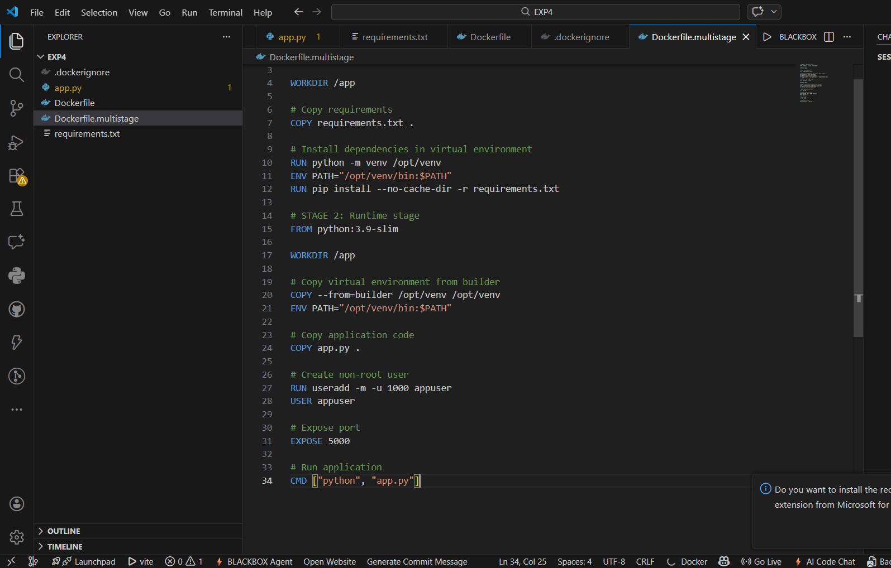
*Explanation:* This multi-stage Dockerfile has two stages: a builder stage that installs dependencies and a runtime stage that only contains what's needed to run the app. The `COPY --from=builder` instruction copies artifacts between stages.

### Step 3: Build and Compare
```bash
# Build regular image
docker build -t flask-regular .

# Build multi-stage image
docker build -f Dockerfile.multistage -t flask-multistage .

# Compare sizes
docker images | grep flask-

# Expected output:
# flask-regular     ~250MB
# flask-multistage  ~150MB (40% smaller!)
```
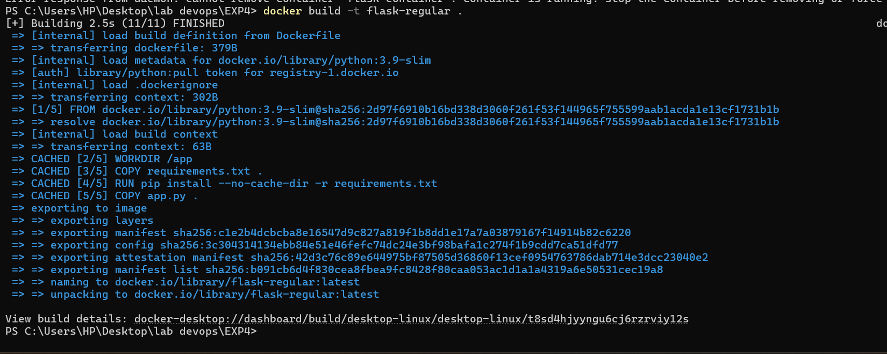
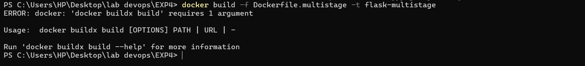
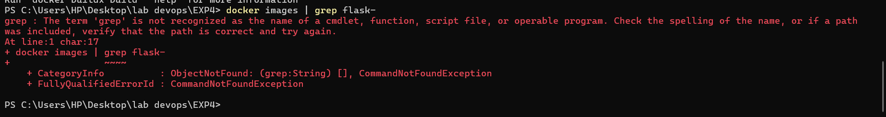
*Explanation:* These commands build both versions of the image and compare their sizes. The `-f` flag specifies which Dockerfile to use. Multi-stage builds typically result in significantly smaller images by excluding build-time dependencies.

---
## Part 6: Publishing to Docker Hub
### Step 1: Prepare for Publishing
```bash
# Login to Docker Hub
docker login

# Tag image for Docker Hub
docker tag my-flask-app:latest username/my-flask-app:1.0
docker tag my-flask-app:latest username/my-flask-app:latest

# Push to Docker Hub
docker push username/my-flask-app:1.0
docker push username/my-flask-app:latest
```
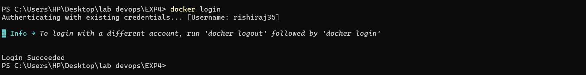
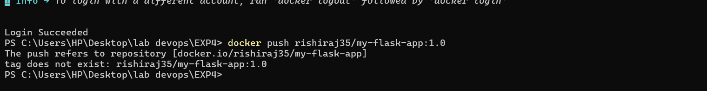
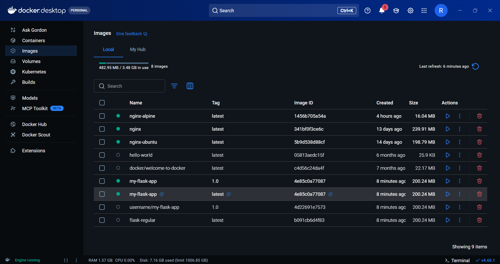
*Explanation:* `docker login` authenticates with Docker Hub. Tagging with your username prepares the image for pushing to your Docker Hub repository. `docker push` uploads the image to the registry, making it available for others to pull.

### Step 2: Pull and Run from Docker Hub
```bash
# Pull from Docker Hub (on another machine)
docker pull username/my-flask-app:latest

# Run the pulled image
docker run -d -p 5000:5000 username/my-flask-app:latest
```
*Explanation:* `docker pull` downloads images from Docker Hub. This allows you to run containers from images built elsewhere, enabling deployment across different environments.

---
## Part 7: Node.js Example (Quick Version)
### Step 1: Node.js Application
```bash
mkdir my-node-app
cd my-node-app
```
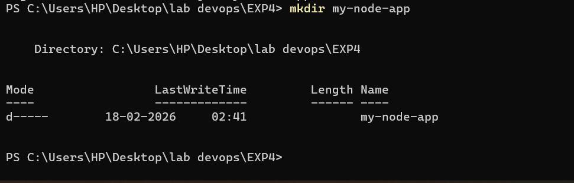
*Explanation:* Create a directory for the Node.js application, similar to what we did for the Flask app.

**app.js:**
```javascript
const express = require('express');
const app = express();
const port = 3000;

app.get('/', (req, res) => {
    res.send('Hello from Node.js Docker!');
});

app.get('/health', (req, res) => {
    res.json({ status: 'healthy' });
});

app.listen(port, () => {
    console.log(`Server running on port ${port}`);
});
```
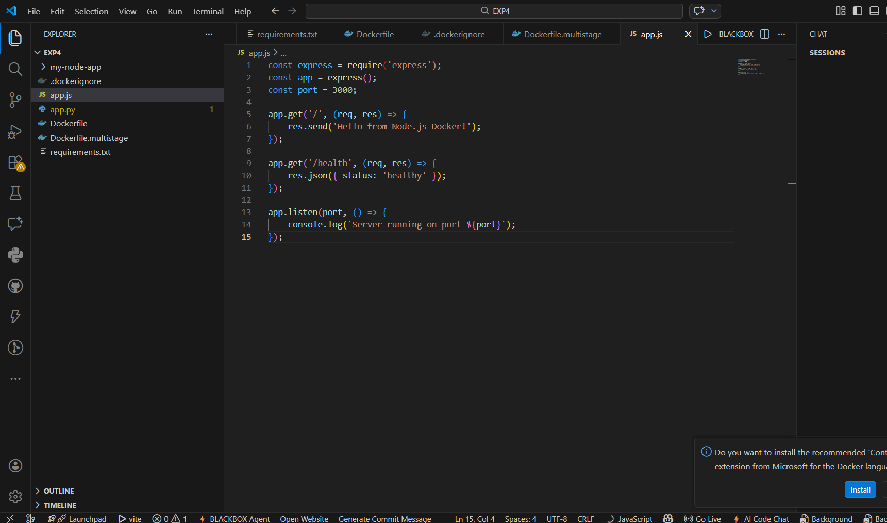
*Explanation:* This Express.js application creates a simple web server with two endpoints: a root route that returns a greeting and a health check endpoint that returns JSON status.

**package.json:**
```json
{
  "name": "node-docker-app",
  "version": "1.0.0",
  "main": "app.js",
  "dependencies": {
    "express": "^4.18.2"
  }
}
```
*Explanation:* The package.json file defines the Node.js project metadata and dependencies. Express.js is specified as the only runtime dependency.

### Step 2: Node.js Dockerfile
```dockerfile
FROM node:18-alpine

WORKDIR /app

COPY package*.json ./
RUN npm install --only=production

COPY app.js .

EXPOSE 3000

CMD ["node", "app.js"]
```
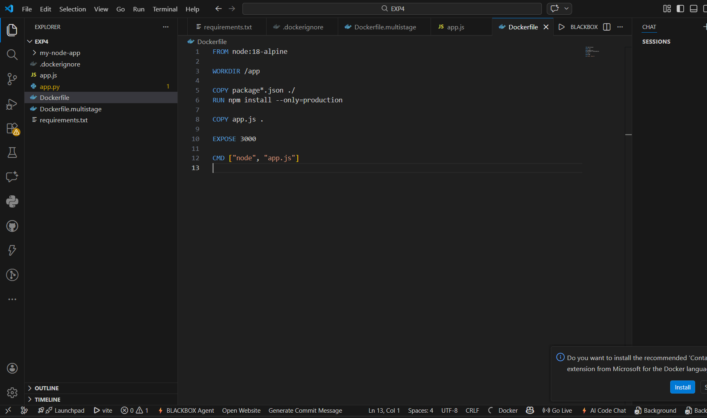
*Explanation:* This Dockerfile uses a lightweight Alpine-based Node.js image. It copies package files first for better caching, installs only production dependencies, copies the app code, exposes port 3000, and runs the application.

### Step 3: Build and Run
```bash
# Build image
docker build -t my-node-app .

# Run container
docker run -d -p 3000:3000 --name node-container my-node-app

# Test
curl http://localhost:3000
```
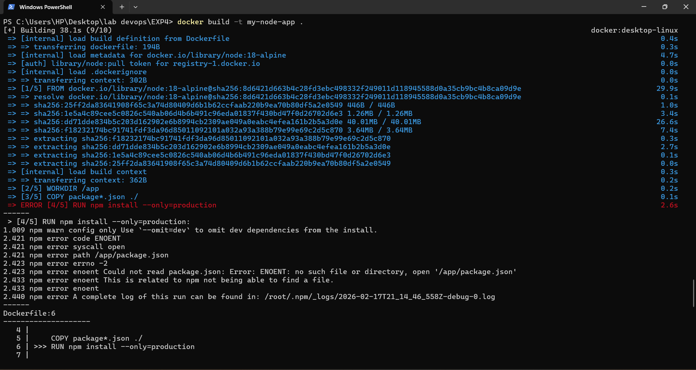
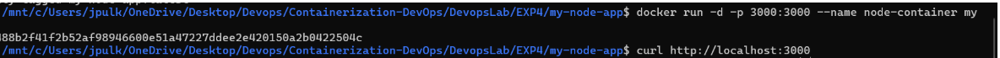
*Explanation:* These commands build the Node.js image, run it in a container with port mapping, and test the application. The process is identical to the Flask example but demonstrates containerizing a different technology stack.

---
