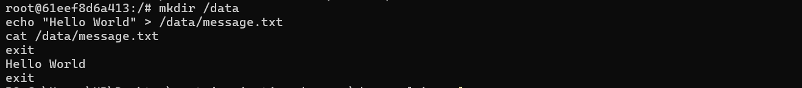
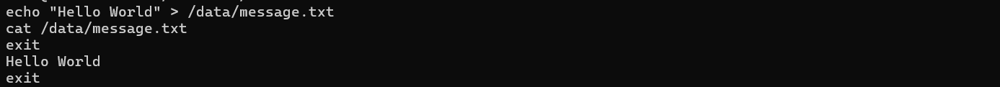

**Name:** Rishiraj Singh
**SAP ID:** 500123612 
**Batch:** B3 (CCVT)

# Lab – Experiment 5

## Data Persistence, Volumes, Environment Variables, Networking, Logs & Monitoring

---
## Lab Objectives
- Understand Docker data persistence using anonymous, named and bind mounts
- Manage environment variables and `.env` files for container configuration
- Inspect container logs, processes and live resource usage
- Create and use custom networks and share service data across containers
- Apply basic monitoring and cleanup commands for Docker resources

---
## Prerequisites
- Docker installed and running
- Basic familiarity with `docker run`, `docker volume`, `docker exec`, `docker inspect` and Linux shell

---
## Part 1 — Volumes and Data Persistence

1. Start an interactive Ubuntu container and write data to a mounted path (no volume):

```bash
docker run -it --name test-container ubuntu /bin/bash
# Inside container:
echo "Hello World" > /data/message.txt
cat /data/message.txt  # Shows "Hello World"
exit
```
 



If you restart the container without a volume, you'll find the data missing because the directory `/data` was not persisted to a volume.

2. Create an anonymous volume automatically (Docker creates a random-name volume):

```bash
docker run -d -v /app/data --name web1 nginx
docker volume ls
```
 


This shows an anonymous volume entry (random hash name) in `docker volume ls`.

3. Create a named volume and use it (recommended for persistent app data):

```bash
docker volume create mydata
docker run -d -v mydata:/app/data --name web2 nginx
docker volume ls
docker volume inspect mydata
```
 


Explanation: Named volumes are managed by Docker and can be safely attached to multiple containers. Data written to `/app/data` inside the container is stored in `mydata` on the Docker host.

4. Bind-mount a host directory so files are directly visible on the host filesystem:

```bash
mkdir -p ~/myapp-data
docker run -d -v ~/myapp-data:/app/data --name web3 nginx
echo "From Host" > ~/myapp-data/host-file.txt
docker exec web3 cat /app/data/host-file.txt
```


Explanation: Bind mounts map a host path into the container. Files created on the host are immediately visible in the container and vice-versa.

5. Example: MySQL using a named volume to persist database files:

```bash
docker run -d \
  --name mysql-db \
  -v mysql-data:/var/lib/mysql \
  -e MYSQL_ROOT_PASSWORD=secret \
  mysql:8.0

# Stop and remove container, then re-run using same volume to preserve data
docker stop mysql-db
docker rm mysql-db
docker run -d \
  --name new-mysql \
  -v mysql-data:/var/lib/mysql \
  -e MYSQL_ROOT_PASSWORD=secret \
  mysql:8.0
```
 


Explanation: The `mysql-data` named volume keeps database files on the host so recreating containers with the same volume preserves the DB.

---
## Part 2 — Bind-mounting configuration files

1. Prepare an NGINX config directory on the host and mount a single config file into container:

```bash
mkdir -p ~/nginx-config
echo 'server {\n    listen 80;\n    server_name localhost;\n    location / {\n        return 200 "Hello from mounted config!";\n    }\n}' > ~/nginx-config/nginx.conf

docker run -d \
  --name nginx-custom \
  -p 8080:80 \
  -v ~/nginx-config/nginx.conf:/etc/nginx/conf.d/default.conf \
  nginx

curl http://localhost:8080
```


Explanation: Mounting a single config file allows you to quickly test and iterate on server configuration from the host.

---
## Part 3 — Volumes: manage and inspect

- Create a docker volume:

```bash
docker volume create app-volume
docker volume inspect app-volume
```
 


- Remove unused volumes:

```bash
docker volume prune
docker volume rm volume-name  # remove a specific volume
```

- Copy files into a container (useful for seeding volumes):

```bash
docker cp local-file.txt container-name:/path/in/volume
```
Explanation: `docker cp` lets you transfer files to/from a container; this is handy for backups or seeding data when volumes are used.

---
## Part 4 — Environment variables and `.env` files

1. Passing single variables at runtime:

```bash
docker run -d \
  --name app1 \
  -e DATABASE_URL="postgres://user:pass@db:5432/mydb" \
  -e DEBUG="true" \
  -p 3000:3000 \
  my-node-app
```
 


2. Using multiple `-e` variables:

```bash
docker run -d \
  -e VAR1=value1 \
  -e VAR2=value2 \
  -e VAR3=value3 \
  my-app
```
 


3. Use an `.env` file to store variables and pass them with `--env-file`:

```bash
echo "DATABASE_HOST=localhost" > .env
echo "DATABASE_PORT=5432" >> .env
echo "API_KEY=secret123" >> .env

docker run -d \
  --env-file .env \
  --name app2 \
  my-app
```
 


Explanation: `.env` files simplify environment configuration and avoid leaking secrets in shell history. `ENV` in Dockerfile sets defaults that can be overridden at runtime.

Example `Dockerfile` snippet (Flask):

```dockerfile
FROM python:3.9-slim
ENV PYTHONUNBUFFERED=1
ENV PYTHONDONTWRITEBYTECODE=1
WORKDIR /app
COPY requirements.txt .
RUN pip install -r requirements.txt
COPY app.py .
ENV PORT=5000
ENV DEBUG=false
EXPOSE 5000
CMD ["python", "app.py"]
```
 


---
## Part 5 — Inspecting containers, logs and resource usage

- View environment of a running container:

```bash
docker exec flask-app env
docker exec flask-app printenv DATABASE_HOST
```
 


- View processes inside container:

```bash
docker top container-name
```
 


- View logs:

```bash
docker logs container-name
docker logs -f container-name            # follow logs
docker logs --tail 100 -t container-name # last 100 lines with timestamps
```
 


- Live resource usage:

```bash
docker stats                # live stats for all containers
docker stats --no-stream    # single snapshot
docker stats --format "table {{.Name}}\t{{.CPUPerc}}\t{{.MemUsage}}\t{{.NetIO}}"
```
 


Explanation: `docker stats` is useful for quick performance checks; logs and `docker top` help diagnose problems.

---
## Part 6 — Networks and service discovery

- List networks and create a user-defined bridge for service discovery:

```bash
docker network ls
docker network create my-network
docker network inspect my-network

docker run -d --name web1 --network my-network nginx
docker run -d --name web2 --network my-network nginx
docker exec web1 curl http://web2
```
 


Explanation: Containers on the same user-defined bridge can resolve each other by container name. Use `host` or `none` networks for special cases.


---
## Part 8 — Basic monitoring script (included in repo)

The repository includes `monitor.sh` which provides a quick overview of running containers, resource usage and recent events. Example usage:

```bash
bash monitor.sh
```


---
