**Name:** Rishiraj Singh 
**SAP ID:** 500123612
**Batch:** B3 (CCVT)

# Lab – Experiment 6

## Docker Run vs Docker Compose: Multi-Container Application Orchestration

---
## Lab Objectives
After completing this lab, students will be able to:
- Understand the relationship between `docker run` (imperative) and Docker Compose (declarative) approaches
- Compare Docker Run command flags with Docker Compose YAML configuration
- Deploy single and multi-container applications using both methods
- Convert Docker Run commands to Docker Compose configuration
- Manage volumes, networks, and environment variables with Docker Compose
- Use Dockerfile with Docker Compose build option
- Deploy production-ready applications with container orchestration

---
## Prerequisites
- Docker installed and running
- Basic knowledge of: `docker run`, port mapping, volume mounting, networking
- Understanding of YAML file format
- Familiarity with environment variables

---
## Part A – Theory

### 1. Objective
To understand the relationship between docker run and Docker Compose, and to compare their configuration syntax and use cases.

---
### 2. Background Theory

#### 2.1 Docker Run (Imperative Approach)
The `docker run` command is used to create and start a container from an image. It requires explicit flags for configuration, making it an imperative approach (step-by-step instructions).

**Docker Run Configuration Options:**
```bash
-p              # Port mapping (HOST:CONTAINER)
-v              # Volume mounting (HOST:CONTAINER)
-e              # Environment variables
--network       # Network configuration
--restart       # Restart policies
--memory        # Memory limits
--cpus          # CPU limits
--name          # Container name
-d              # Run in detached mode
```

**Advantages:**
- Direct control over each parameter
- Quick testing and experimentation
- Suitable for simple one-off container runs

**Disadvantages:**
- Complex to manage multiple containers
- Difficult to version and reproduce
- Error-prone with long command chains
- Not suitable for production deployments

**Example: Running Nginx with Docker Run**
```bash
docker run -d \
  --name my-nginx \
  -p 8080:80 \
  -v ./html:/usr/share/nginx/html \
  -e NGINX_HOST=localhost \
  --restart unless-stopped \
  nginx:alpine
```

**Command Explanation:**
- `-d`: Detached mode (runs in background)
- `--name my-nginx`: Assigns container name
- `-p 8080:80`: Maps port 8080 (host) to 80 (container)
- `-v ./html:/usr/share/nginx/html`: Mounts HTML files into Nginx directory
- `-e NGINX_HOST=localhost`: Sets environment variable
- `--restart unless-stopped`: Automatically restarts container unless manually stopped
- `nginx:alpine`: Uses lightweight Nginx image

---
#### 2.2 Docker Compose (Declarative Approach)
Docker Compose uses a YAML file (`docker-compose.yml`) to define services, networks, and volumes in a structured format. It's declarative, meaning you define the desired state rather than step-by-step instructions.

**Advantages:**
- Simplifies multi-container applications
- Provides reproducibility and version control
- Unified lifecycle management (up, down, logs, etc.)
- Supports service scaling
- Automatic networking between services
- Easy to document and share

**Disadvantages:**
- Limited for single-host only (no built-in clustering)
- Requires understanding of YAML syntax
- No auto-scaling or self-healing

**Example: Equivalent Docker Compose**
```yaml
version: '3.8'

services:
  nginx:
    image: nginx:alpine
    container_name: my-nginx
    ports:
      - "8080:80"
    volumes:
      - ./html:/usr/share/nginx/html
    environment:
      NGINX_HOST: localhost
    restart: unless-stopped
```

**YAML Structure Explanation:**
- `version`: Docker Compose file format version
- `services`: Defines all containers
- `nginx`: Service name (used for container networking)
- `image`: Docker image to use
- `container_name`: Container name (optional)
- `ports`: Port mappings (HOST:CONTAINER)
- `volumes`: Data persistence mappings
- `environment`: Environment variables for the service
- `restart`: Restart policy

---
### 3. Mapping: Docker Run vs Docker Compose

| Docker Run Flag | Docker Compose Equivalent | Purpose |
|---|---|---|
| `-p 8080:80` | `ports:`<br>&nbsp;&nbsp;- "8080:80" | Port mapping |
| `-v host:container` | `volumes:`<br>&nbsp;&nbsp;- host:container | Volume mounting |
| `-e KEY=value` | `environment:`<br>&nbsp;&nbsp;KEY: value | Environment variables |
| `--name` | `container_name:` | Container name |
| `--network` | `networks:` or auto | Network configuration |
| `--restart` | `restart:` | Restart policy |
| `--memory` | `deploy.resources.limits.memory` | Memory limit |
| `--cpus` | `deploy.resources.limits.cpus` | CPU limit |
| `-d` | `docker compose up -d` | Detached mode |

---
### 4. Advantages of Docker Compose
- **Simplifies multi-container applications**: Single command manages all services
- **Provides reproducibility**: Same configuration works everywhere
- **Version controllable configuration**: Track changes in git
- **Unified lifecycle management**: Deploy and destroy complete stacks
- **Supports service scaling**: `docker compose up --scale web=3`
- **Automatic service discovery**: Services can reach each other by name
- **Clear documentation**: YAML file documents the entire stack

---
## Part B – Practical Tasks

### Task 1: Single Container Comparison

#### Step 1: Run Nginx Using Docker Run

Execute the following command to start Nginx with Docker Run:
```bash
docker run -d \
  --name lab-nginx \
  -p 8081:80 \
  -v $(pwd)/html:/usr/share/nginx/html \
  nginx:alpine
```

**Command Explanation:**
- `docker run`: Create and start a new container
- `-d`: Run in detached mode (background)
- `--name lab-nginx`: Assign name "lab-nginx" to the container
- `-p 8081:80`: Map host port 8081 to container port 80
- `-v $(pwd)/html:/usr/share/nginx/html`: Mount current directory's `html` folder to Nginx document root
- `nginx:alpine`: Use lightweight Nginx image

**Verify the container is running:**
```bash
docker ps
```
*Expected Output:* Container named "lab-nginx" with port 8081->80/tcp
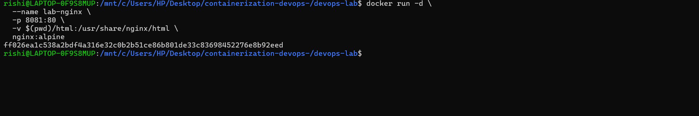
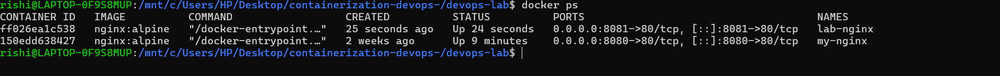

**Access the web server:**
```
http://localhost:8081
```

**Clean up (stop and remove):**
```bash
docker stop lab-nginx
docker rm lab-nginx
```

**Command Explanation:**
- `docker stop`: Gracefully stop the running container
- `docker rm`: Remove the stopped container

---
#### Step 2: Run Same Setup Using Docker Compose

Create the file `docker-compose.yml` in the working directory:
```yaml
version: '3.8'

services:
  nginx:
    image: nginx:alpine
    container_name: lab-nginx
    ports:
      - "8081:80"
    volumes:
      - ./html:/usr/share/nginx/html
```

**YAML Configuration Explanation:**
- `version: '3.8'`: Compatible with modern Docker and Docker Compose
- `services`: Container definitions section
- `nginx`: Service identifier (must be unique)
- `image: nginx:alpine`: Pulls official Nginx with Alpine Linux
- `container_name`: Sets explicit container name
- `ports`: Exposes port 8081 on host to 80 in container
- `volumes`: Mounts local `html` directory to container

**Deploy the stack:**
```bash
docker compose up -d
```


**Command Explanation:**
- `docker compose up`: Create and start services defined in `docker-compose.yml`
- `-d`: Detached mode (runs in background)

**Verify services are running:**
```bash
docker compose ps
```
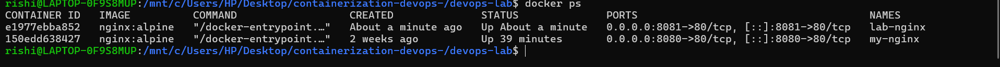

**Access the web server:**
```
http://localhost:8081
```

**Stop and remove the entire stack:**
```bash
docker compose down
```

**Command Explanation:**
- `docker compose down`: Stop and remove all services, networks (but preserves volumes)

---
### Task 2: Multi-Container Application - WordPress + MySQL

#### Objective
Deploy WordPress with MySQL using both Docker Run (manual) and Docker Compose (structured) approaches.

---
#### A. Using Docker Run

**Step 1: Create custom network**
```bash
docker network create wp-net
```


**Command Explanation:**
- `docker network create`: Creates a user-defined bridge network
- `wp-net`: Network name used for service discovery between containers

**Step 2: Run MySQL container**
```bash
docker run -d \
  --name mysql \
  --network wp-net \
  -e MYSQL_ROOT_PASSWORD=secret \
  -e MYSQL_DATABASE=wordpress \
  mysql:5.7
```
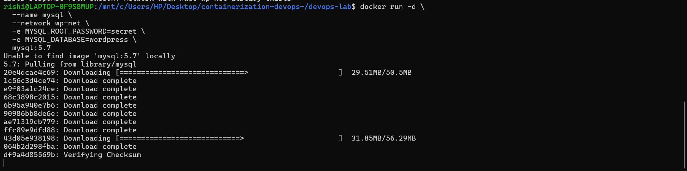

**Command Explanation:**
- `--network wp-net`: Connects container to the custom network
- `-e MYSQL_ROOT_PASSWORD=secret`: Sets MySQL root password
- `-e MYSQL_DATABASE=wordpress`: Creates database named "wordpress"
- `mysql:5.7`: Uses MySQL version 5.7 image

*Wait 10-15 seconds for MySQL to be ready*

**Step 3: Run WordPress container**
```bash
docker run -d \
  --name wordpress \
  --network wp-net \
  -p 8082:80 \
  -e WORDPRESS_DB_HOST=mysql \
  -e WORDPRESS_DB_PASSWORD=secret \
  wordpress:latest
```
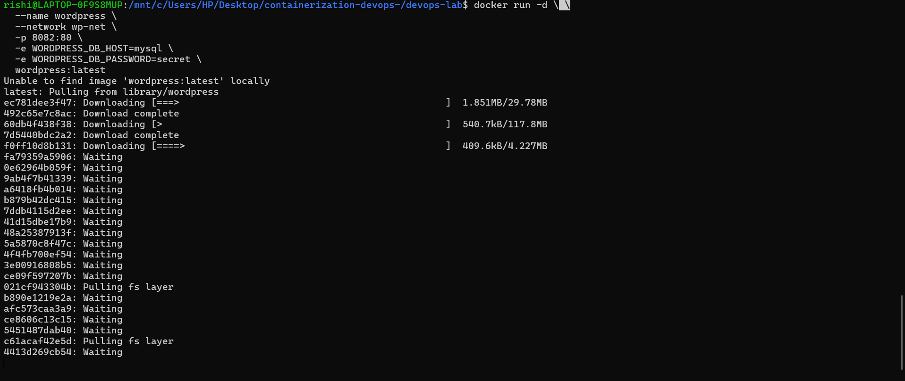

**Command Explanation:**
- `--network wp-net`: Connects to same network as MySQL
- `-p 8082:80`: Maps port 8082 to WordPress port 80
- `-e WORDPRESS_DB_HOST=mysql`: Service name "mysql" autodiscovered via DNS
- `-e WORDPRESS_DB_PASSWORD=secret`: Password matching MySQL configuration

**Verify containers:**
```bash
docker ps
```
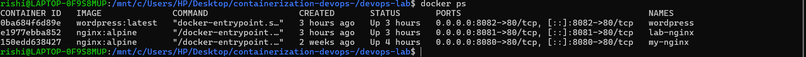

**Test the application:**
```
http://localhost:8082
```
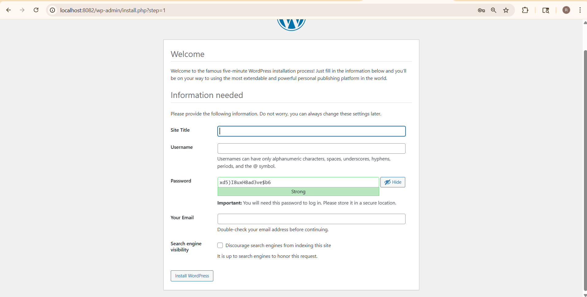

**Clean up:**
```bash
docker stop wordpress mysql
docker rm wordpress mysql
docker network rm wp-net
```

---
#### B. Using Docker Compose

Create file `wp-compose-lab/docker-compose.yml`:
```yaml
version: '3.8'

services:
  mysql:
    image: mysql:5.7
    container_name: wordpress_db
    environment:
      MYSQL_ROOT_PASSWORD: secret
      MYSQL_DATABASE: wordpress
    volumes:
      - mysql_data:/var/lib/mysql

  wordpress:
    image: wordpress:latest
    container_name: wordpress_app
    depends_on:
      - mysql
    ports:
      - "8082:80"
    environment:
      WORDPRESS_DB_HOST: mysql
      WORDPRESS_DB_PASSWORD: secret
      WORDPRESS_DB_NAME: wordpress
    volumes:
      - wp_data:/var/www/html

volumes:
  mysql_data:
  wp_data:
```

**YAML Configuration Explanation:**
- `depends_on`: Ensures MySQL starts before WordPress
- `WORDPRESS_DB_HOST: mysql`: Uses service name for DNS discovery
- `volumes`: Creates named volumes for persistent data
- `mysql_data`: Stores database files
- `wp_data`: Stores WordPress application files

**Deploy the stack:**
```bash
docker compose up -d
```
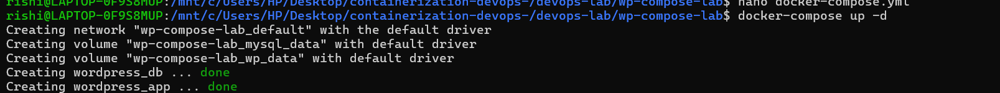

**Verify services:**
```bash
docker ps
docker volume ls
```
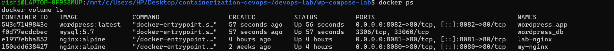
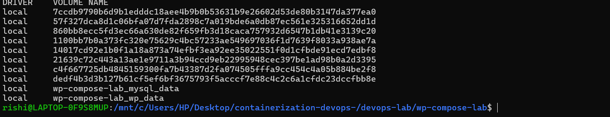

**Access WordPress:**
```
http://localhost:8082
```
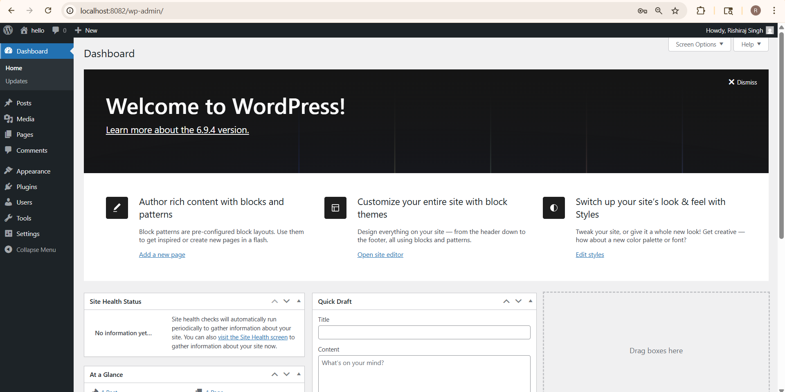

Complete WordPress setup wizard to finalize installation.

**Stop and clean up everything:**
```bash
docker compose down -v
```

**Command Explanation:**
- `-v`: Removes volumes along with containers (careful: removes data!)

---
## Part C – Conversion & Build-Based Tasks

### Task 3: Convert Docker Run to Docker Compose

#### Problem 1: Basic Web Application

**Given Docker Run Command:**
```bash
docker run -d \
  --name webapp \
  -p 5000:5000 \
  -e APP_ENV=production \
  -e DEBUG=false \
  --restart unless-stopped \
  node:18-alpine
```

**Your Task:** Create equivalent `docker-compose.yml`

**Solution:**
```yaml
version: '3.8'

services:
  webapp:
    image: node:18-alpine
    container_name: webapp
    ports:
      - "5000:5000"
    environment:
      APP_ENV: production
      DEBUG: "false"
    restart: unless-stopped
```

**Verification:**
```bash
docker compose up -d
docker compose ps
docker compose logs
docker compose down
```
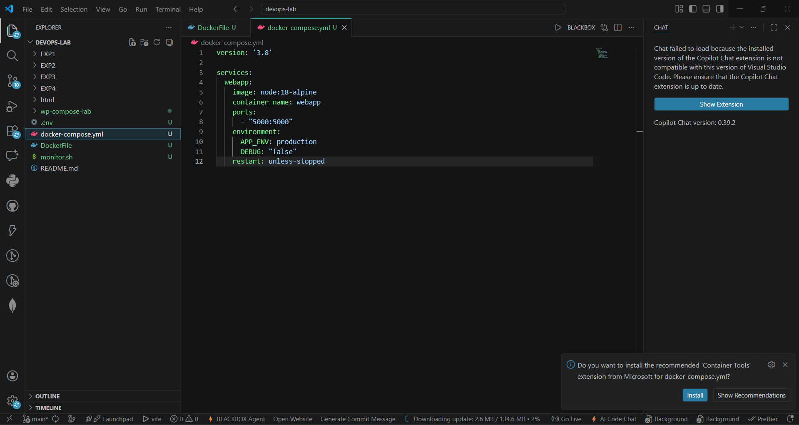
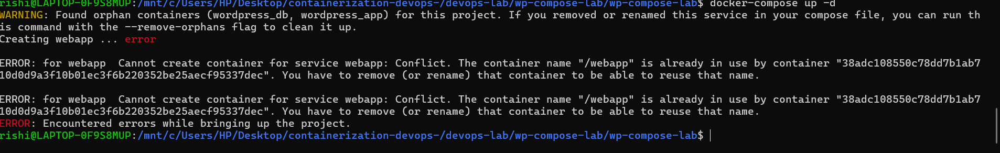

---
#### Problem 2: Volume + Network Configuration

**Given Docker Run Commands:**
```bash
docker network create app-net
docker run -d \
  --name postgres-db \
  --network app-net \
  -e POSTGRES_USER=admin \
  -e POSTGRES_PASSWORD=secret \
  -v pgdata:/var/lib/postgresql/data \
  postgres:15

docker run -d \
  --name backend \
  --network app-net \
  -p 8000:8000 \
  -e DB_HOST=postgres-db \
  -e DB_USER=admin \
  -e DB_PASS=secret \
  python:3.11-slim
```

**Your Task:** Create single `docker-compose.yml` file

**Solution:**
```yaml
version: '3.8'

services:
  postgres-db:
    image: postgres:15
    container_name: postgres-db
    environment:
      POSTGRES_USER: admin
      POSTGRES_PASSWORD: secret
    volumes:
      - pgdata:/var/lib/postgresql/data
    networks:
      - app-net

  backend:
    image: python:3.11-slim
    container_name: backend
    ports:
      - "8000:8000"
    environment:
      DB_HOST: postgres-db
      DB_USER: admin
      DB_PASS: secret
    depends_on:
      - postgres-db
    networks:
      - app-net

volumes:
  pgdata:

networks:
  app-net:
```

**Verification:**
```bash
docker compose up -d
docker compose ps
docker network ls
docker compose down -v
```
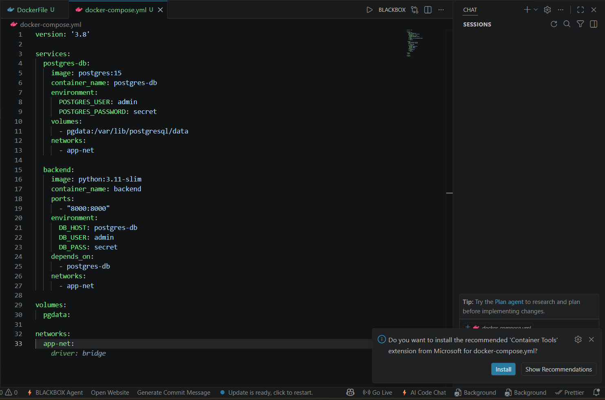
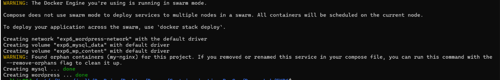

---
---
## Best Practices for Docker Compose

1. **Use meaningful service names** - Helps with debugging and understanding
2. **Explicit ports** - Always map ports explicitly for clarity
3. **Environment variables** - Use `.env` files for credentials
4. **Volume strategy** - Use named volumes for persistence
5. **Health checks** - Add healthcheck directives for critical services
6. **Resource limits** - Set memory and CPU limits to prevent resource hogging
7. **Logging** - Configure logging drivers for centralized log management
8. **Versioning** - Use specific image tags, avoid `latest` in production

---

**Key Takeaways:**
- Docker Run is ideal for quick testing
- Docker Compose is essential for managing multi-container applications
- YAML is version-controllable and reproducible
- Understanding the mapping helps transition between approaches
- Multi-stage builds create optimized production images
