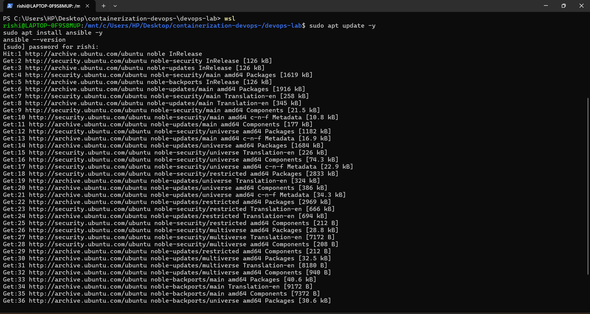
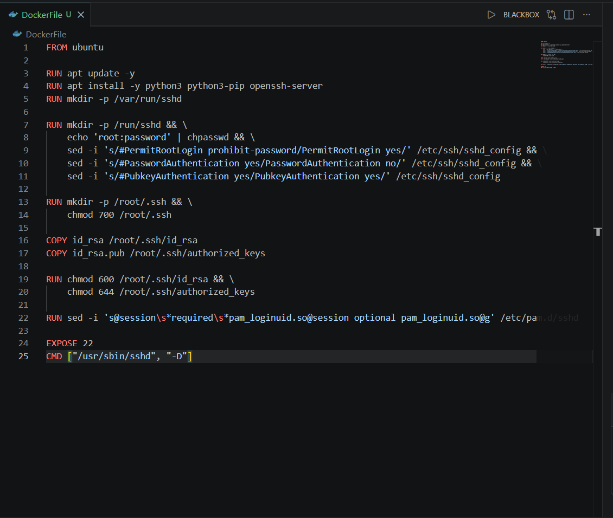
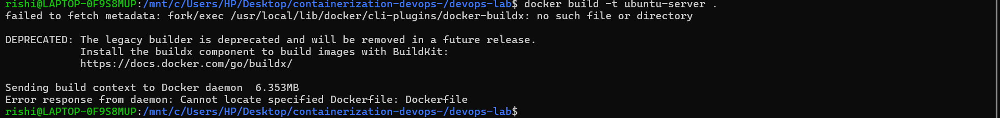
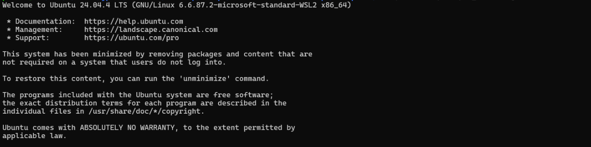
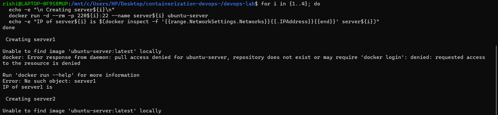
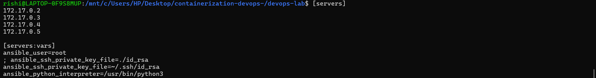
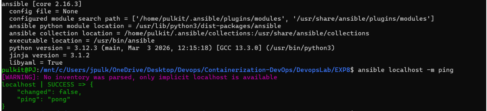
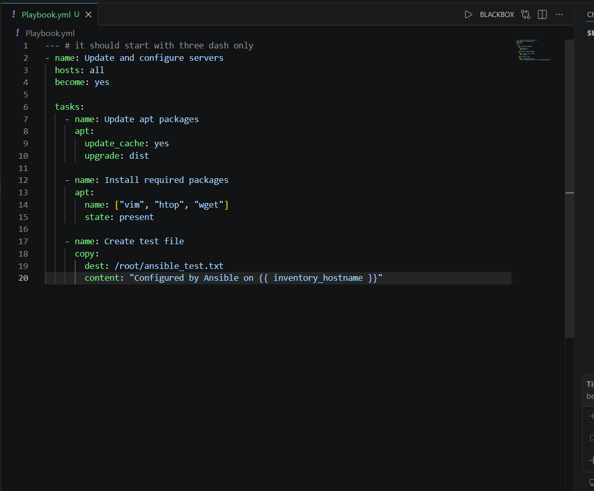
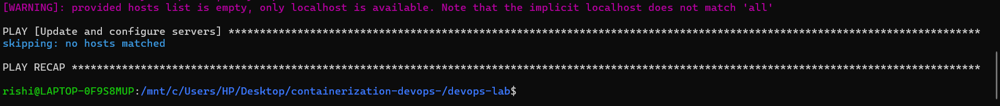

# Lab - Experiment 8

## Ansible

**Name:** Rishiraj Singh  
**SAP ID:** 500123612
**Batch:** B3 (CCVT)

---

## 1. Theory

### 1.1 Problem Statement

Managing infrastructure manually across multiple servers leads to configuration drift, inconsistent environments, and repetitive work. As the number of servers grows, manual SSH-based administration becomes slow, error-prone, and difficult to maintain.

### 1.2 What is Ansible?

Ansible is an open-source automation tool used for configuration management, application deployment, and orchestration.

It follows an agentless architecture:

- Uses SSH for Linux systems
- Uses WinRM for Windows systems
- Uses YAML-based playbooks to define automation tasks

### 1.3 How Ansible Solves the Problem

- Agentless architecture: no software needs to be installed on managed nodes
- Idempotency: running the same playbook multiple times produces the same desired state
- Declarative syntax: describe the final state instead of manually listing every action
- Push-based model: changes are initiated from the control node

### 1.4 Key Concepts

| Component | Description |
|---|---|
| Control Node | Machine where Ansible is installed |
| Managed Nodes | Target systems being configured |
| Inventory | File that lists managed nodes and variables |
| Playbooks | YAML files containing automation steps |
| Tasks | Individual actions inside a playbook |
| Modules | Built-in functions such as `apt`, `yum`, `copy`, and `service` |
| Roles | Reusable automation structure |

### 1.5 Benefits of Using Ansible

- Free and open source
- Easy to start using
- No extra agents required on managed nodes
- Supports modular, reusable automation
- Strong documentation and community support
- Useful for servers, cloud, and networking tasks

---

## 2. Part A - Ansible Demo

### 2.1 Install Ansible

Ansible can be installed with Python `pip` or through package managers such as `apt`.

#### Using pip

```bash
pip install ansible
ansible --version
```

#### Using apt

```bash
sudo apt update -y
sudo apt install ansible -y
ansible --version
```



#### Why this step matters

This installs the Ansible command-line tools on the control node so it can connect to managed nodes and execute playbooks.

### 2.2 Post-installation Check

```bash
ansible localhost -m ping
```

Expected output:

```text
localhost | SUCCESS => {
    "changed": false,
    "ping": "pong"
}
```

This confirms that Ansible is installed correctly and can run modules locally.

---

## 3. Create Docker Image and Test SSH Login

### 3.1 Generate SSH Key Pair

Generate an RSA key pair in WSL or on your local machine:

```bash
ssh-keygen -t rsa -b 4096
cp ~/.ssh/id_rsa.pub .
cp ~/.ssh/id_rsa .
```


#### Why this step matters

The private key stays on the control node, while the public key is placed inside the Docker image so the container can accept SSH key-based authentication.

### 3.2 Create the Dockerfile

The Docker image is based on Ubuntu and includes Python and OpenSSH.

```dockerfile
FROM ubuntu

RUN apt update -y
RUN apt install -y python3 python3-pip openssh-server
RUN mkdir -p /var/run/sshd

RUN mkdir -p /run/sshd && \
    echo 'root:password' | chpasswd && \
    sed -i 's/#PermitRootLogin prohibit-password/PermitRootLogin yes/' /etc/ssh/sshd_config && \
    sed -i 's/#PasswordAuthentication yes/PasswordAuthentication no/' /etc/ssh/sshd_config && \
    sed -i 's/#PubkeyAuthentication yes/PubkeyAuthentication yes/' /etc/ssh/sshd_config

RUN mkdir -p /root/.ssh && \
    chmod 700 /root/.ssh

COPY id_rsa /root/.ssh/id_rsa
COPY id_rsa.pub /root/.ssh/authorized_keys

RUN chmod 600 /root/.ssh/id_rsa && \
    chmod 644 /root/.ssh/authorized_keys

RUN sed -i 's@session\s*required\s*pam_loginuid.so@session optional pam_loginuid.so@g' /etc/pam.d/sshd

EXPOSE 22
CMD ["/usr/sbin/sshd", "-D"]
```



#### Explanation of the Dockerfile

- Installs OpenSSH server and Python
- Enables root login for lab use
- Disables password authentication and enables key-based login
- Copies the SSH keys into the image
- Starts the SSH daemon when the container launches

### 3.3 Build the Docker Image

```bash
docker build -t ubuntu-server .
```



This creates a custom Ubuntu image that behaves like a small SSH server for Ansible testing.

### 3.4 Test SSH Connectivity

Run the container and verify SSH access:

```bash
docker run -d --rm -p 2222:22 --name ssh-test-server ubuntu-server
ssh -i ~/.ssh/id_rsa root@localhost -p 2222
```



#### Why this step matters

Ansible uses SSH to connect to managed nodes, so SSH login must work before moving on to inventory and playbook execution.

---

## 4. Ansible with Docker Exercise

### 4.1 Start Four Test Servers

Use the custom image to run four containers that act as managed nodes:

```bash
for i in {1..4}; do
  echo -e "\n Creating server${i}\n"
  docker run -d --rm -p 220${i}:22 --name server${i} ubuntu-server
  echo -e "IP of server${i} is $(docker inspect -f '{{range.NetworkSettings.Networks}}{{.IPAddress}}{{end}}' server${i})"
done
```



These containers simulate multiple servers that can be managed through Ansible.

### 4.2 Create the Inventory File

The inventory lists the IP addresses of the containers and sets shared variables.

```ini
[servers]
172.17.0.2
172.17.0.3
172.17.0.4
172.17.0.5

[servers:vars]
ansible_user=root
; ansible_ssh_private_key_file=./id_rsa
ansible_ssh_private_key_file=~/.ssh/id_rsa
ansible_python_interpreter=/usr/bin/python3
```


#### Why this step matters

Inventory tells Ansible which hosts to manage and which connection settings to use.

### 4.3 Review the Inventory

```bash
cat inventory.ini
```



This confirms the server list and connection variables are correct before running Ansible.

### 4.4 Test Ansible Connectivity

```bash
ansible all -i inventory.ini -m ping
```

Expected output shows each host replying with `pong`.



#### Why this step matters

The ping module checks that Ansible can reach every managed node using SSH.

---

## 5. Create and Run the Playbook

### 5.1 Create the Playbook

The playbook updates packages, installs tools, and creates a file on every server.

```yaml
--- # it should start with three dash only
- name: Update and configure servers
  hosts: all
  become: yes

  tasks:
    - name: Update apt packages
      apt:
        update_cache: yes
        upgrade: dist

    - name: Install required packages
      apt:
        name: ["vim", "htop", "wget"]
        state: present

    - name: Create test file
      copy:
        dest: /root/ansible_test.txt
        content: "Configured by Ansible on {{ inventory_hostname }}"
```



#### Explanation of the playbook

- `hosts: all` runs the tasks on every host in the inventory
- `become: yes` gives the playbook root privileges
- `apt` updates package lists and installs software
- `copy` creates a test file to prove the playbook executed successfully

### 5.2 Run the Playbook

```bash
ansible-playbook -i inventory.ini playbook.yml
```



This applies the desired configuration to all managed nodes.

### 5.3 Verify the Changes

Use Ansible to confirm the file exists on all servers:

```bash
ansible all -i inventory.ini -m command -a "cat /root/ansible_test.txt"
```

You can also verify manually inside each container.

#### Why this step matters

Verification confirms that the playbook not only ran, but also changed the target machines as expected.

---

## 6. Try This Playbook Also

The following playbook demonstrates additional automation tasks such as collecting system information and printing debug output.

```yaml
--- # it should start with three dash only
- name: Configure multiple servers
  hosts: servers
  become: yes

  tasks:
    - name: Update apt package index
      apt:
        update_cache: yes

    - name: Install Python 3.13 (or latest available)
      apt:
        name: python3
        state: latest

    - name: Create test file with content
      copy:
        dest: /root/test_file.txt
        content: |
          This is a test file created by Ansible
          Server name: {{ inventory_hostname }}
          Current date: {{ ansible_date_time.date }}

    - name: Display system information
      command: uname -a
      register: uname_output

    - name: Show disk space
      command: df -h
      register: disk_space

    - name: Print results
      debug:
        msg:
          - "System info: {{ uname_output.stdout }}"
          - "Disk space: {{ disk_space.stdout_lines }}"
```

#### Why this playbook is useful

- It shows how to run commands remotely
- It demonstrates use of `register` and `debug`
- It combines configuration, file creation, and diagnostics in one playbook

---

## 7. The Need for Ansible in Server Management

Ansible is useful because it solves several operational problems:

- Scalability: managing many servers manually is not practical
- Consistency: every server gets the same configuration
- Efficiency: repetitive tasks are automated
- Idempotency: the same playbook can be run repeatedly without unwanted side effects
- Infrastructure as Code: configuration is version controlled and documented

### Key Features

- Agentless: uses SSH or WinRM
- YAML-based playbooks: simple and readable
- Modules: built-in support for packages, files, services, cloud, networking, and more
- Push-based execution: changes are started from the control node
- Multi-platform support: Linux, Windows, cloud, and networking devices

### Why Choose Ansible?

- No agent installation on managed nodes
- Extensible through Python
- Easy to learn and use
- Suitable for small labs and large-scale automation

#### Troubleshooting Commands

```bash
ansible-doc -l
ansible-doc apt
ansible-doc -l | grep aws
```


## 8. Observations

- SSH key-based login is required for Ansible-managed hosts
- Docker containers are useful for quickly simulating multiple servers
- Inventory files make it easy to organize managed nodes
- Playbooks provide repeatable and readable automation
- Ansible `ping` is a quick connectivity check before running a full playbook

---

## 9. Result

The Ansible workflow was successfully demonstrated using Docker containers as managed nodes. A custom SSH-enabled Ubuntu image was built, multiple containers were started, inventory was created, connectivity was verified, and playbooks were executed successfully.

---

## 10. Conclusion

This experiment demonstrates how Ansible simplifies server management by replacing manual SSH-based administration with automated, repeatable, and version-controlled playbooks. The Docker-based setup makes it easy to test Ansible concepts locally before using them on real infrastructure.
